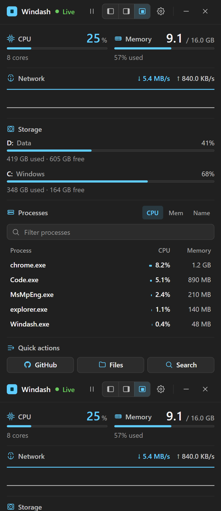
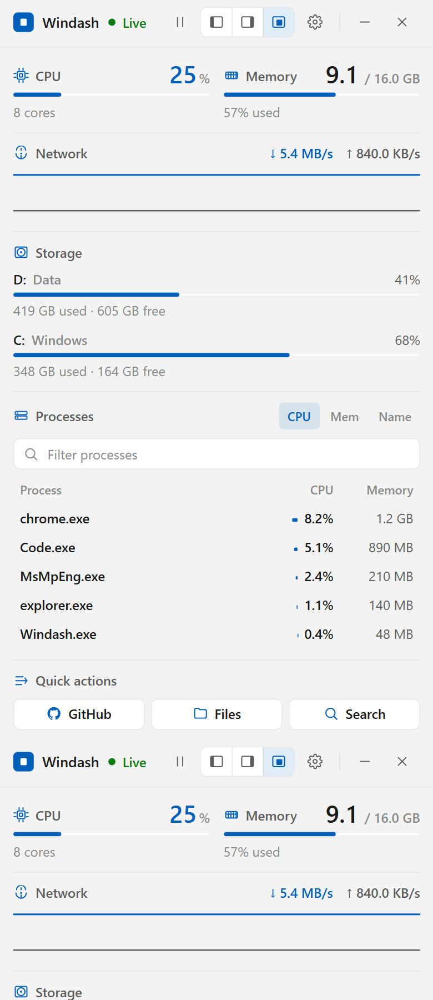

# ⚡ Windash

A personal **Windows system dashboard** — a lightweight, tray-resident desktop app that shows live system stats, quick actions, and a persistent notes strip. Built with a high-performance **Rust** core and a responsive **React** UI adhering to Windows 11 design language.

<p align="center">
  
  &nbsp;&nbsp;
  
</p>

> **Stack**: **Tauri 2** (Rust core) · **React 18 + TypeScript** (UI) · **Vite** (bundler)  
> **Backdrop**: Windows 11 Mica material (via `window-vibrancy`) matching the effective light/dark theme  
> **Metrics**: System, network, disk, and process telemetry via [`sysinfo 0.32`](https://crates.io/crates/sysinfo)

---

## Features

- **Live CPU %** gauge with color-coded warning/critical thresholds.
- **Memory usage** bar (used / total) with formatted gigabyte/megabyte readouts.
- **Network telemetry** up/down throughput with a 60-sample sparkline history.
- **Per-disk space** monitors for all fixed NTFS/FAT drives with capacity and usage bars.
- **Top processes** sorted by CPU, Memory, or Name with instant filtering (`/` or `Ctrl+F` shortcut).
- **Safe process termination**:
  - Requires explicit user confirmation in the UI.
  - Hardened with **process identity verification** (PID, start time, and process name) re-checked immediately before calling `taskkill.exe`.
  - Immune to Windows PID reuse attacks: if a process exits and its PID is reassigned to another program, termination is safely rejected.
  - Protected Windows processes (System Idle Process, System, protected services) and Windash itself cannot be terminated.
- **Quick actions**:
  - Open File Explorer or reveal any process executable's location.
  - Windows Search with query parameter sanitization and URL percent-encoding.
- **Persistent Notes**:
  - Add and remove quick notes, preserved across restarts in AppData.
  - Resilient parser recovers notes even if metadata was damaged or saved as a bare array.
- **Multi-Monitor Work-Area Docking**:
  - Dock to the left or right monitor edge as an always-on-top sidebar or float freely.
  - Docked layout respects the **Windows monitor Work Area**, automatically adjusting for taskbars positioned at the bottom, top, left, or right.
  - Multi-monitor geometry resolution preserves negative monitor coordinates (monitors placed to the left or above the primary display) and gracefully falls back to the primary display if an external monitor is disconnected.
  - Trailing-edge debounced persistence prevents disk thrashing while dragging.
- **Live Windows Theme Synchronization**:
  - Listens natively to Windows OS theme change events (`ThemeChanged`) and immediately syncs the React UI and native Mica material between light and dark modes without registry polling loops.
- **Crash-Safe Persistence & Backup Rotation**:
  - Atomic file writes using same-directory temporary files and native `MoveFileExW` (`MOVEFILE_REPLACE_EXISTING`) with explicit flushing and synchronization (`sync_all`).
  - Corrupted configuration or notes files are automatically preserved to `<name>.corrupt-<timestamp>.bak` (rotating up to 5 backups) before initializing safe defaults, preventing accidental data loss.
- **Hardened Security Posture**:
  - Strict Content Security Policy (CSP) isolating scripts, styles, images, and IPC channels.
  - `withGlobalTauri` disabled; communication strictly uses modular `@tauri-apps/api` bindings.
  - Minimally scoped Tauri 2 capabilities with strictly allowlisted external URLs (e.g. GitHub repository link).
  - Native argument vectors for all process executions; no shell string parsing or `cmd.exe /C` command execution.
- **Global Shortcut & Tray**:
  - `Ctrl+Shift+D` toggles the window visibility from anywhere.
  - Tray icon with quick menu (Show, Hide, Toggle, Settings, Quit).

---

## Getting Started

### Prerequisites

- [Rust](https://www.rust-lang.org/tools/install) (stable toolchain)
- [Node.js](https://nodejs.org/) (v18 or v20 LTS)
- Windows 10/11 with **Microsoft Visual C++ Build Tools** (MSVC)
- [WebView2 Runtime](https://developer.microsoft.com/en-us/microsoft-edge/webview2/) (pre-installed on Windows 10/11)

### Development

```bash
# Install frontend dependencies
npm install

# Run the Tauri 2 desktop app in development mode
npm run tauri dev
```

### Running Tests & Linting

```bash
# Run frontend unit tests (Vitest)
npm test

# Build frontend assets (TypeScript + Vite)
npm run build

# Run Rust unit tests (41 tests)
cargo test --manifest-path src-tauri/Cargo.toml

# Run Rust formatting and clippy checks
cargo fmt --manifest-path src-tauri/Cargo.toml -- --check
cargo clippy --manifest-path src-tauri/Cargo.toml --all-targets -- -D warnings
```

### Build Production Installer

```bash
npm run tauri build
```

The signed NSIS installer and standalone `.exe` are generated in `src-tauri/target/release/bundle/nsis/`.

---

## Architecture & Project Layout

```
windash/
├── .github/workflows/       # GitHub Actions CI workflow (windows-latest)
├── src/                     # React 18 + TypeScript frontend
│   ├── components/          # UI components (Gauge, ProcList, NotesStrip, etc.)
│   ├── bridge.ts            # Tauri IPC bridge with browser mock preview support
│   ├── format.ts            # Formatting, friendly errors, and search filtering
│   ├── theme.ts             # Theme tokens and metrics styling helpers
│   ├── types.ts             # Strict TypeScript definitions matching Rust payloads
│   └── App.tsx              # Shell, layout engine, and event listeners
├── src-tauri/               # Tauri 2 Rust core
│   ├── capabilities/        # Scoped permission manifests (opener, shortcuts, core)
│   ├── src/
│   │   ├── dock.rs          # Monitor work-area docking calculation and edge snapping
│   │   ├── geom.rs          # Multi-monitor coordinate placement & debounced persistence
│   │   ├── metrics.rs       # sysinfo wrapper & process termination identity validation
│   │   ├── notes.rs         # Crash-safe notes store with corruption recovery
│   │   ├── persist.rs       # Atomic tempfile writes & rotating backup manager
│   │   ├── settings.rs      # Type-safe settings store with lenient deserialization
│   │   └── lib.rs           # IPC commands, tray, shortcuts, and lifecycle events
│   ├── Cargo.toml           # Rust package configuration and release optimizations
│   └── tauri.conf.json      # Tauri 2 security policies, windows, and capabilities
```

---

## License

[MIT](LICENSE)
